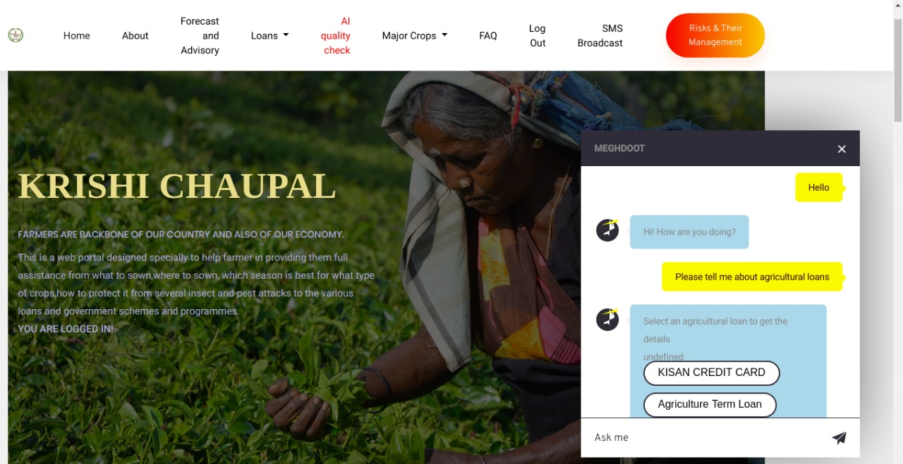
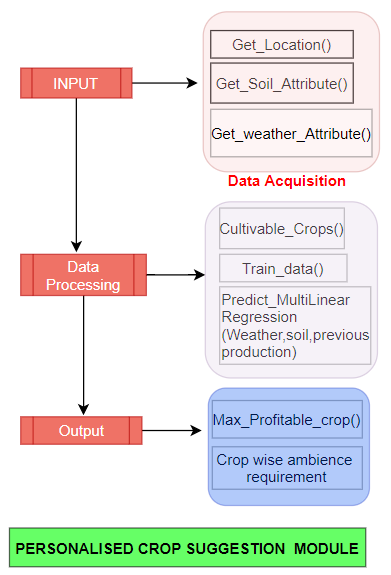
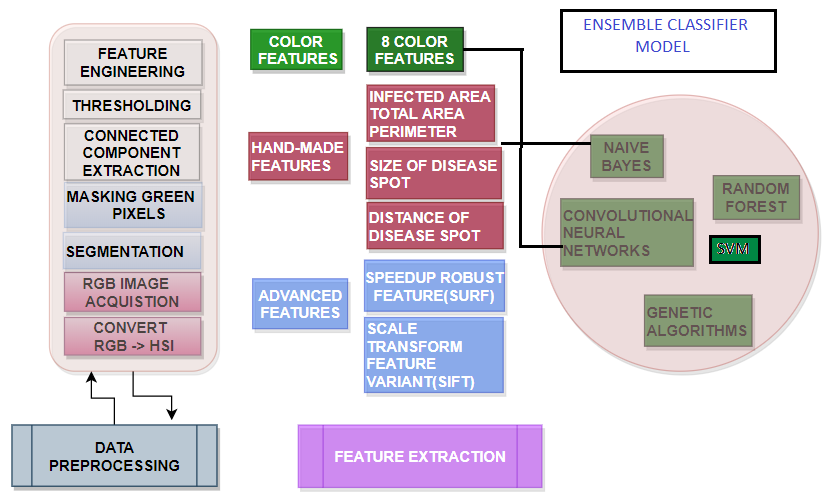
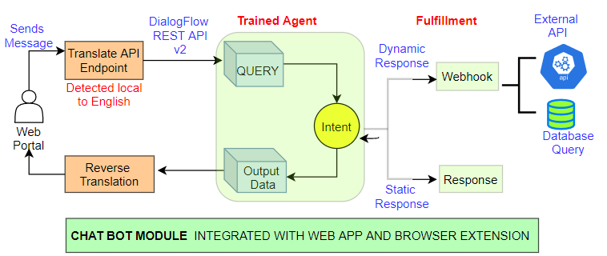
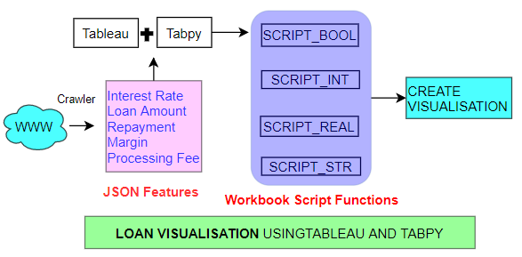

# Krishi-Chaupal


* **Krishi Chaupal** is an AI powered web portal that provides personalised crop advisory based on weather patterns using **embedded Machine Learning Model** . 

* Enables farmers for better financial planning by data aggregation and visualisation of loans through **tableau** . 

- Performs crop quality check using **ensemble Machine Learning Classification Model** trained on **self-designed features**. 

- It has a built-in **multi-lingual chatbot** for real-time assistance to farmers ,made using **DialogFlow** and **google translate API** . 

- The portal offers the Government Agencies to **broadcast** update when there is major pest attack,weather warnings etc, using **Django Twilio API** . 

- It displays real-time state wise crop advisory , weather forecast according to Indian Metrological Department and also provides various agricultural schemes of State and Central Government using **Scheduled Web Scraping** and **multi-threading** which speeds up the process by **1.5x** . 

- It has portal for Agro-marketing which provides transparency to farmers to sell their crops on current market prices . 

- The  portal is **multi-lingual** using django support for internationalization and localization, introducing local middleware to parse a request and decide what translation object to install in current thread context and set appropriate language in URL. 

- We provide **REST API** for our Crop quality check and loan visualisation module so that any third party can interact. 

- **Browser extenstion** for ask me interface which act as our mini support over other platforms.

## Running the tests

### Getting Started

These instructions will get you a copy of the project up and running on your local machine for development and testing purposes. See deployment for notes on how to deploy the project on a live system.

### Prerequisites

What things you need to install the software and how to install them

```
Give examples
```

### Installing

A step by step series of examples that tell you how to get a development env running
### Install Python

### Linux Users
It is very likely that you already have Python installed out of the box. To check if you have it installed (and which version it is), open a console and type the following command:

```
$ python3 --version
Python 3.6.1
```
### Windows Users
You can download Python for Windows from the website https://www.python.org/downloads/windows/. Click on the "Latest Python 3 Release - Python x.x.x" link. If your computer is running a 64-bit version of Windows, download the Windows x86-64 executable installer. Otherwise, download the Windows x86 executable installer. After downloading the installer, you should run it (double-click on it) and follow the instructions there.

One thing to watch out for: During the installation, you will notice a window marked "Setup". Make sure you tick the "Add Python 3.6 to PATH" or 'Add Python to your environment variables" checkbox and click on "Install Now".
And repeat
When the installation completes, you may see a dialog box with a link you can follow to learn more about Python or about the version you installed. Close or cancel that dialog -- you'll be learning more in this tutorial!

### Virtual environment
All you need to do is find a directory in which you want to create the virtualenv; your home directory, for example. On Windows, it might look like C:\Users\Name\ (where Name is the name of your login).

We will make a virtualenv called myvenv. The general command will be in the format:
```
$ python3 -m venv myvenv

```
### Working with virtualenv
The command above will create a directory called myvenv (or whatever name you chose) that contains our virtual environment (basically a bunch of directory and files).

### Working with virtualenv: Windows
Start your virtual environment by running:
```
C:\Users\Name\Krishi_Chaupal> myvenv\Scripts\activate
```
### Working with virtualenv: Linux and OS X
Start your virtual environment by running:
```
$ source myvenv/bin/activate
```
### Installing Django
Now that you have your virtualenv started, you can install Django.

Before we do that, we should make sure we have the latest version of pip, the software that we use to install Django:
```
(myvenv) ~$ python -m pip install --upgrade pip
```
Now, run pip install -r requirements.txt to install Django.
```
(myvenv) ~$ pip install -r requirements.txt
```
### Migrate Database
```
(myvenv) ~$ python manage.py migrate
```
### Migrations
```
(myvenv) ~$ python manage.py makemigrations
```
### Starting the web server
You need to be in the directory that contains the manage.py file. In the console, we can start the web server by running python manage.py runserver:
```
(myvenv) ~/Krishi_Chaupal$ python manage.py runserver
```

## Flowchart of different module

### Crop Suggestion


### Crop Quality Check


### Chatbot


### Loan Visualization


